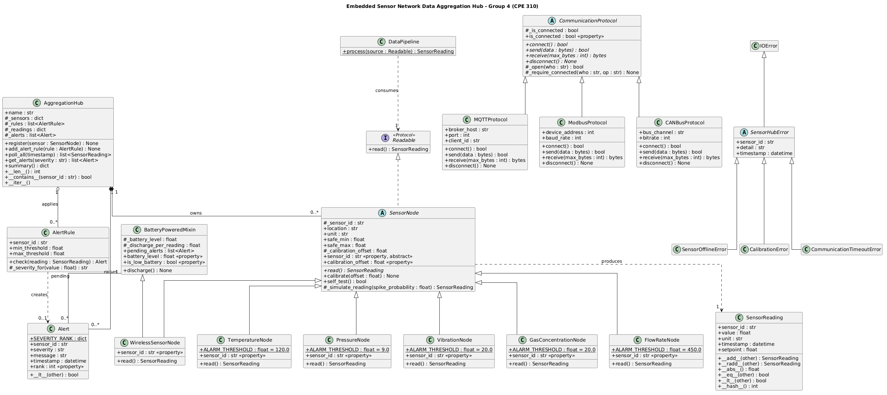

"⁸# Embedded Sensor Network Data Aggregation Hub

A multi-protocol IoT sensor simulation system for industrial monitoring — built with Python OOP for **CPE 310: Object-Oriented Programming with Python**, Federal University Oye-Ekiti.

Repository: https://github.com/ikezuefrank/Embedded-Sensor-Network-Data-Aggregation-Hub

---

## 1. Project Title and Overview

**Embedded Sensor Network Data Aggregation Hub** is a command-line Python application that simulates a heterogeneous industrial IoT deployment of the kind used in Nigerian manufacturing, oil & gas, and power generation facilities. Five distinct sensor types (temperature, pressure, vibration, gas concentration, flow rate) generate readings that are transmitted over three simulated communication protocols (MQTT, Modbus, CAN Bus) to a central `AggregationHub`. The hub calibrates incoming data, evaluates configurable threshold-based alert rules, prioritises and queues alerts by severity, tracks battery depletion for wireless nodes, and exports aggregated statistics in a JSON-serialisable summary. The project demonstrates a complete OOP design — abstraction, encapsulation, inheritance (including cooperative multiple inheritance), and polymorphism — applied to a realistic embedded systems data pipeline.

---

## 2. Team Members — Group 4

| S/N | Surname | Other Names | Registration Number | GitHub Username |
|---|---|---|---|---|
| 1 | Emans | Gift Oghenemine | CPE/2023/1043 | — |
| 2 | Emmanuel | Faith Aanuoluwa | CPE/2023/1044 | EmpressFaith |
| 3 | Esan | Samuel Moyinoluwa | CPE/2023/1045 | Sunnie360 |
| 4 | Essien | David Uwem | CPE/2023/1046 | — |
| 5 | Fakorede | Chinedum Temidayo | CPE/2023/1047 | ⁠⁠fakoredechi-byte |
| 6 | Falade | Olamide Ebenezer | CPE/2023/1048 | olamidefalade71|
| 7 | Falaiye | Tobiloba Kayode | CPE/2023/1049 | FalaiyeAdesina |
| 8 | Fasuyi | Kingsley Oluwatosin | CPE/2023/1050 | kingsley2244 |
| 9 | Fele | Olamide Micheal | CPE/2023/1051 |  Olliboi-01 |
| 10 | Fowowe | Stephen Oluwamodimu | CPE/2023/1052 | jerrysteve207 |
| 11 | Ibukunoluwa | Oluwanifemi Favour | CPE/2023/1053 | Ibuksmonii40|
| 12 | Ikezue | Munachukwu Franknoris | CPE/2023/1054 | ikezuefrank |
| 13 | Ilukoyenikan | Adeolu Joseph | CPE/2023/1055 | — |
| 14 | Istifanus | Godspower Joseph | CPE/2023/1056 | Istifanus02 |
| 15 | Iwuchukwu | Miracle Oluebube | CPE/2023/1057 | — |

---

## 3. OOP Concepts Demonstrated

| OOP Concept | Location in Code | Week |
|---|---|---|
| Class design, constructors, `__str__`/`__repr__` | `src/sensors.py`, all sensor classes | Week 1 |
| Encapsulation — `sensor_id` pattern validation (`SN-TTTT-NN`) | `src/sensors.py`, `SensorNode.__init__` | Week 2 |
| `@property` — validated `calibration_offset` | `src/sensors.py`, `SensorNode.calibration_offset` | Week 2 |
| Custom exception hierarchy — `SensorOfflineError`, `CalibrationError`, `CommunicationTimeoutError` | `src/exceptions.py` | Week 2 |
| Abstract base class — `SensorNode(ABC)` | `src/sensors.py` | Week 3 |
| Abstract base class — `CommunicationProtocol(ABC)` | `src/protocols.py` | Week 3 |
| Concrete inheritance — `TemperatureNode`, `PressureNode`, `VibrationNode`, `GasConcentrationNode`, `FlowRateNode` | `src/sensors.py` | Week 3 |
| Concrete inheritance — `MQTTProtocol`, `ModbusProtocol`, `CANBusProtocol` | `src/protocols.py` | Week 3 |
| Cooperative multiple inheritance — `WirelessSensorNode(SensorNode, BatteryPoweredMixin)` + `super()` MRO chaining | `src/sensors.py` | Week 3 |
| Operator overloading — `__add__`, `__radd__`, `__abs__`, `__eq__`, `__lt__`, `__hash__` on `SensorReading` | `src/readings.py` | Week 4 |
| `@total_ordering` decorator | `src/readings.py` | Week 4 |
| Duck typing via `typing.Protocol` — `Readable`, used in `DataPipeline.process()` | `src/pipeline.py` | Week 4 |
| Polymorphism — `__contains__`, `__len__`, `__iter__` on `AggregationHub` | `src/hub.py` | Week 4 |
| Priority ordering — `__lt__` on `Alert` | `src/alerts.py` | Week 4 |
| UML class diagram (full hierarchy + relationships) | `uml/class_diagram.png`, `uml/class_diagram.puml` | Week 5 |

*Exact line numbers will be added once the implementation stabilises — add them as a third sub-note in each row (e.g. "lines 35–52") before final submission, since the rubric checks that the table matches the actual source.*

---

## 4. System Architecture



The system is organised around five cooperating subsystems: the `SensorNode` hierarchy (abstract base plus five concrete sensor types and a wirelessly-powered variant), the `CommunicationProtocol` hierarchy (abstract base plus MQTT, Modbus, and CAN Bus implementations), the `SensorReading` value object that flows between them, the `AlertRule`/`Alert` pair that evaluates and records threshold breaches, and the `AggregationHub` that ties everything together. `AggregationHub` composes its registered `SensorNode` instances — sensors are created by and belong exclusively to the hub they're registered with, and their lifecycle ends when the hub releases them — whereas its relationship to `CommunicationProtocol` objects is aggregation, since protocol instances can be constructed and configured independently of any particular hub and are merely referenced for the duration of a transmission. `WirelessSensorNode` uses cooperative multiple inheritance from `SensorNode` and `BatteryPoweredMixin`, relying on Python's MRO and `super()` chaining so both parent initialisers run correctly. Polymorphism is centred on `AggregationHub`, which treats every registered sensor uniformly through the `SensorNode` interface regardless of concrete subclass, and on `DataPipeline.process()`, which accepts any object satisfying the `Readable` protocol rather than requiring a specific class.

---

## 5. How to Run

```bash
# Clone the repository
git clone https://github.com/ikezuefrank/Embedded-Sensor-Network-Data-Aggregation-Hub.git
cd Embedded-Sensor-Network-Data-Aggregation-Hub

# Create and activate a virtual environment
python3 -m venv venv
source venv/bin/activate        # Windows: venv\Scripts\activate

# Install dependencies
pip install -r requirements.txt

# Run the main demonstration
python main.py

# Run the test suite
pytest tests/ -v
```

---

## 6. Sample Output

*This section must be replaced with real console output captured by actually running `python main.py` (minimum 8 lines), once the system is implemented. Pasting fabricated output here would misrepresent the state of the code, so leave this section empty in commits until you have genuine output to paste, then fill it in before tagging `v1.0`.*

```
$ python main.py

```

---

## 7. Known Limitations

*To be completed honestly once development is underway — this section is mandatory and is graded on specificity, so list the actual simplifications you made (e.g. which protocol behaviours are stubbed, whether persistence is in-memory only, any sensor types with reduced realism). Omitting this section costs 5 marks; filling it with invented content would misrepresent your work, so write it last, after implementation.*

---

## 8. References

- Python `abc` module documentation — https://docs.python.org/3/library/abc.html
- Python `typing.Protocol` documentation — https://docs.python.org/3/library/typing.html#typing.Protocol
- `functools.total_ordering` documentation — https://docs.python.org/3/library/functools.html#functools.total_ordering
- `datetime` / `timedelta` documentation — https://docs.python.org/3/library/datetime.html
- pytest documentation — https://docs.pytest.org/

*Add any additional sources, lecture notes, or external materials your team actually consulted.*

---

## Repository Structure

```
Embedded-Sensor-Network-Data-Aggregation-Hub/
├── README.md
├── .gitignore
├── requirements.txt
├── main.py
├── src/
│   ├── __init__.py
│   ├── sensors.py
│   ├── protocols.py
│   ├── readings.py
│   ├── alerts.py
│   ├── hub.py
│   ├── pipeline.py
│   └── exceptions.py
├── tests/
│   ├── __init__.py
│   └── test_*.py
├── uml/
│   ├── class_diagram.png
│   └── class_diagram.puml
└── docs/
    └── design_notes.md
```

**Course:** CPE 310 — Object-Oriented Programming with Python | **Department:** Computer Engineering, FUOYE | **AY:** 2025/2026 | **Group:** 4 of 10
